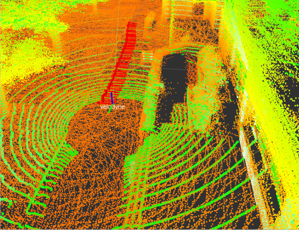
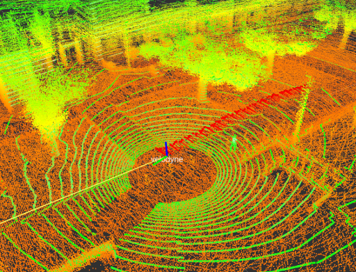
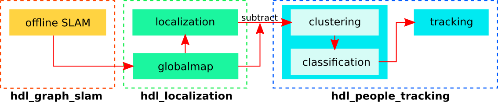

# New packages arrived

We released a new open source 3D mapping framework [GLIM](https://github.com/koide3/glim).  
We also developed a map-based localization system [GLIL](https://koide3.github.io/glil_pubdoc/) as closed source.

# hdl_localization
***hdl_localization*** is a ROS package for real-time 3D localization using a 3D LIDAR, such as velodyne HDL32e and VLP16. This package performs Unscented Kalman Filter-based pose estimation. It first estimates the sensor pose from IMU data implemented on the LIDAR, and then performs multi-threaded NDT scan matching between a globalmap point cloud and input point clouds to correct the estimated pose. IMU-based pose prediction is optional. If you disable it, the system uses the constant velocity model without IMU information.

Video:<br>
[](https://youtu.be/1EyF9kxJOqA)

[](https://travis-ci.org/koide3/hdl_global_localization)

## Requirements
***hdl_localization*** requires the following libraries:
- PCL
- OpenMP

The following ros packages are required:
- pcl_ros
- [ndt_omp](https://github.com/bo2-mw3/ndtomp)
- [fast_gicp](https://github.com/SMRT-AIST/fast_gicp)
- [hdl_global_localization](https://github.com/koide3/hdl_global_localization)
- [point_cloud_converter](https://github.com/bo2-mw3/pcc)

## Installation

```bash
cd /your/catkin_ws/src
git clone https://github.com/bo2-mw3/ndtomp
git clone https://github.com/SMRT-AIST/fast_gicp --recursive
git clone https://github.com/koide3/hdl_localization
git clone https://github.com/koide3/hdl_global_localization
git clone https://github.com/bo2-mw3/point_cloud_converter

cd /your/catkin_ws
catkin_make -DCMAKE_BUILD_TYPE=Release

# if you want to enable CUDA-accelerated NDT
# catkin_make -DCMAKE_BUILD_TYPE=Release -DBUILD_VGICP_CUDA=ON
```
## Docker

```
cd /your/catkin_ws/src/test/docker
docker build -t hdl_localization .
```
When you have finished it, use the command `docker images` and you can see the output below.  
```
REPOSITORY                   TAG                   IMAGE ID         CREATED          SIZE
hdl_localization             latest                338f71fd2fb3     12 seconds ago   2.37GB
```
**3. Make docker container**  

When you create a docker container, you need several options to use the GUI and share folders.

First, you should enter the command below in the local terminal to enable docker to communicate with Xserver on the host.

```
xhost +local:docker
```

After that, make your own container with the command below.

```
docker run --privileged -it \
           --gpus all \
           -e NVIDIA_DRIVER_CAPABILITIES=all \
           -e NVIDIA_VISIBLE_DEVICES=all \
           --volume=/tmp/.X11-unix:/tmp/.X11-unix:rw \
           --net=host \
           --ipc=host \
           --shm-size=1gb \
           --env="DISPLAY=$DISPLAY" \
           --name=${docker container name} --volume=${hdl_localization_repo_root}:/root/catkin_ws/src ${docker image} /bin/bash
```

**:warning: You should change {hdl_localization_repo_root}, {docker container name}, {docker image} to suit your environment.**

If you have successfully created the docker container, the terminal output will be similar to the below.  

```
================Docker Env Ready================
root@taeyoung-cilab:/root/catkin_ws#
```

**4. Build hdl localization package and run it!**  

Four terminal windows are required.  
Two enter the docker container, and the other two are local terminals.  

Please run the roscore on one local terminal.  
```
roscore
```

Inside the docker container, run the build and run the package.  
```
catkin_make
```
```
source devel/setup.bash
```
```
rosparam set use_sim_time true
```
```
roslaunch hdl_localization hdl_localization.launch
```

Open another terminal and enter the docker container.  
```
docker exec -it -w /root/catkin_ws/ hdl_localization /bin/bash
```
Set up the environment on another terminal.  
```
source /opt/ros/melodic/setup.bash
```
Run rviz.  
```
cd src/hdl_localization/rviz
```
```
rviz -d hdl_localization.rviz
```

Open another terminal and enter the docker container.  
```
docker exec -it -w /root/catkin_ws/ hdl_localization /bin/bash
```
Set up the environment on another terminal.  
```
source /opt/ros/melodic/setup.bash
```
```
source devel/setup.bash
roslaunch point_cloud_converter point_cloud_converter.launch
```


Run the sample bag file at the last local terminal.  
```
rosbag play hdl_400.bag  
```


### Support docker :whale:  

Using docker, you can conveniently satisfy the requirement environment.  
Please refer to the repository below and use the docker easily.  

- [Taeyoung96/hdl_localization_tutorial](https://github.com/Taeyoung96/hdl_localization_tutorial)

## Parameters
All configurable parameters are listed in *launch/hdl_localization.launch* as ros params.
The estimated pose can be reset using using "2D Pose Estimate" on rviz

## Topics
- ***/odom*** (nav_msgs/Odometry)
  - Estimated sensor pose in the map frame
- ***/aligned_points***
  - Input point cloud aligned with the map
- ***/status*** (hdl_localization/ScanMatchingStatus)
  - Scan matching result information (e.g., convergence, matching error, and inlier fraction)

## Services
- ***/relocalize*** (std_srvs/Empty)
  - Reset the sensor pose with the global localization result
  - For details of the global localization method, see [hdl_global_localization](https://github.com/koide3/hdl_global_localization)

## Example

Example bag file (recorded in an outdoor environment): [hdl_400.bag.tar.gz](http://www.aisl.cs.tut.ac.jp/databases/hdl_graph_slam/hdl_400.bag.tar.gz) (933MB)

```bash
rosparam set use_sim_time true
roslaunch hdl_localization hdl_localization.launch
```

```bash
roscd hdl_localization/rviz
rviz -d hdl_localization.rviz
```

```bash
rosbag play --clock hdl_400.bag
```

```bash
# perform global localization
rosservice call /relocalize
```


## evaluation
```
rostopic echo /odom | awk '
  /secs:/ {s=$2} 
  /nsecs:/ {ns=$2} 
  /position:/{getline; tx=$2; getline; ty=$2; getline; tz=$2} 
  /orientation:/{getline; qx=$2; getline; qy=$2; getline; qz=$2; getline; qw=$2; 
  print s+ns*1e-9, tx, ty, tz, qx, qy, qz, qw}' > odom_data.txt
```
 

If it doesn't work well or the CPU usage is too high, change *ndt_neighbor_search_method* in *hdl_localization.launch* to "DIRECT1". It makes the scan matching significantly fast, but a bit unstable.

## Related packages

- [interactive_slam](https://github.com/koide3/interactive_slam)
- <a href="https://github.com/koide3/hdl_graph_slam">hdl_graph_slam</a>
- <a href="https://github.com/koide3/hdl_localization">hdl_localization</a>
- <a href="https://github.com/koide3/hdl_global_localization">hdl_global_localization</a>
- <a href="https://github.com/koide3/hdl_people_tracking">hdl_people_tracking</a>



Kenji Koide, Jun Miura, and Emanuele Menegatti, A Portable 3D LIDAR-based System for Long-term and Wide-area People Behavior Measurement, Advanced Robotic Systems, 2019 [[link]](https://www.researchgate.net/publication/331283709_A_Portable_3D_LIDAR-based_System_for_Long-term_and_Wide-area_People_Behavior_Measurement).

## Contact
Kenji Koide, k.koide@aist.go.jp

Active Intelligent Systems Laboratory, Toyohashi University of Technology, Japan [\[URL\]](http://www.aisl.cs.tut.ac.jp)
Human-Centered Mobility Research Center, National Institute of Advanced Industrial Science and Technology, Japan  [\[URL\]](https://unit.aist.go.jp/rirc/en/team/smart_mobility.html)


